# 一些工具/小游戏

有时会有一些想法希望可以通过浏览器实现。
记录备用

#归档
----
- [x] Markdown编辑器
    -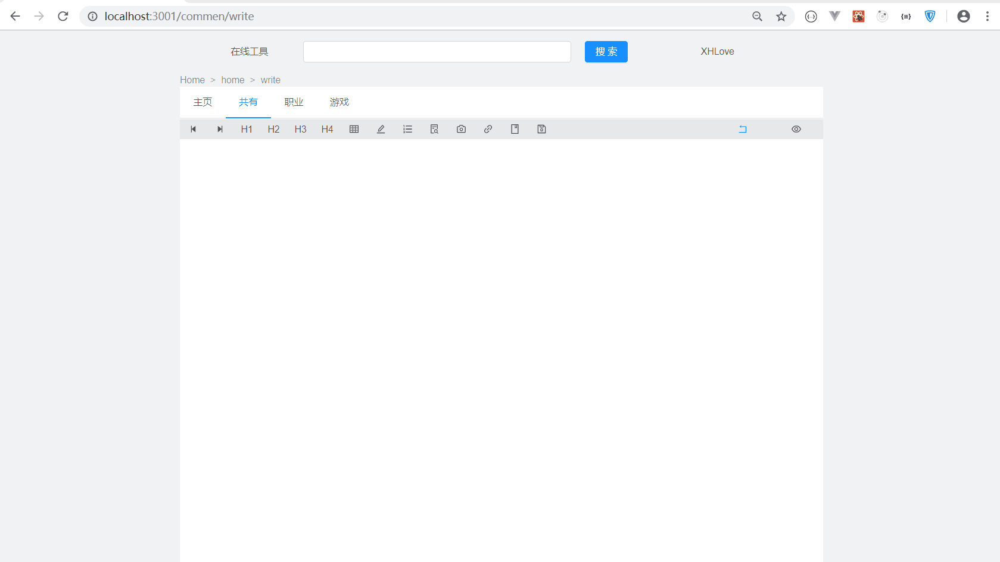
- [x] 大学学校展示
	- 包括学校图标， 名称，排名等信息。
	- 数据通过网上数据并经过一些正则表达式处理
	-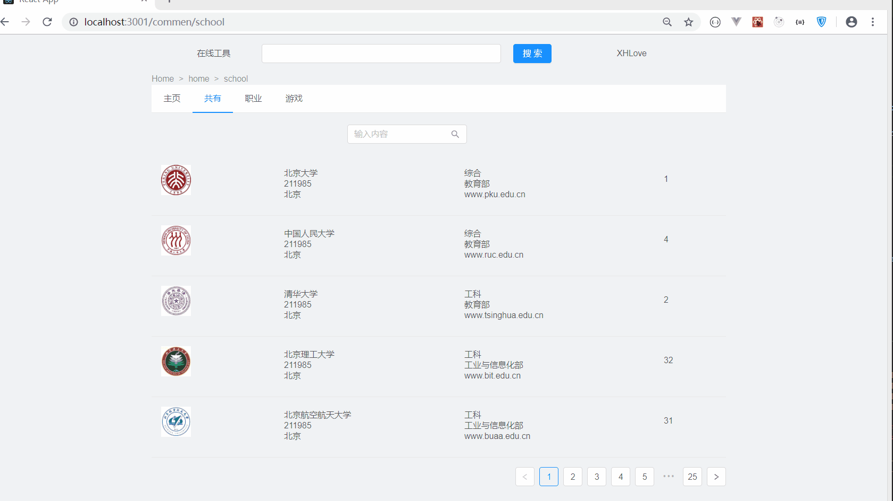
- [x] 简易计算器
	-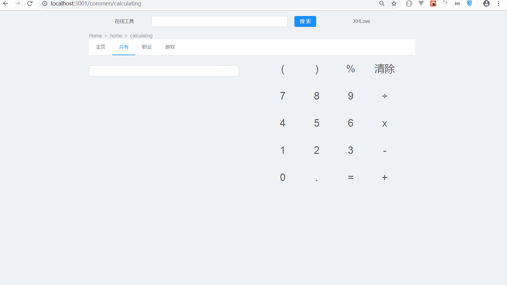
- [x] 关系计算器
	-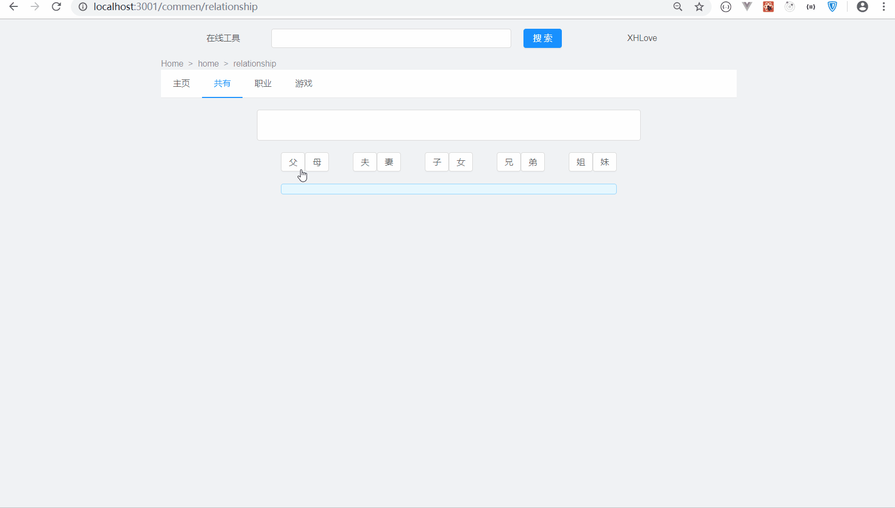
- [x] 常用颜色
	-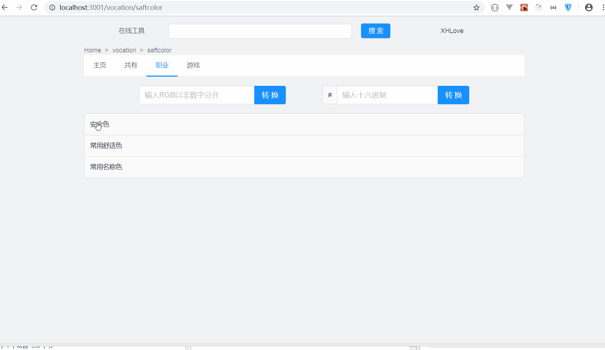
- [x] 一个排序算法动画
	- 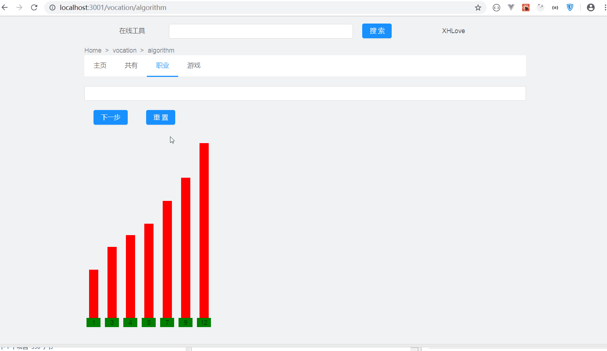
- [x] 加密
	-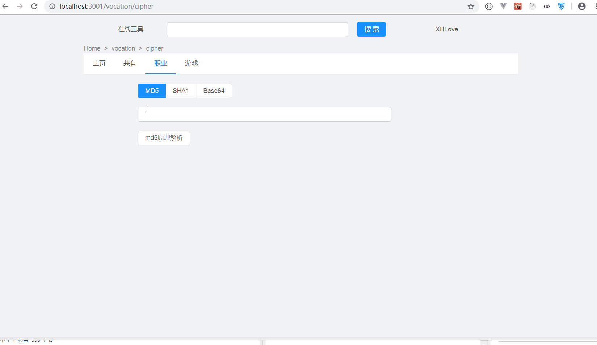
- [x] 二维码生成与下载
	- 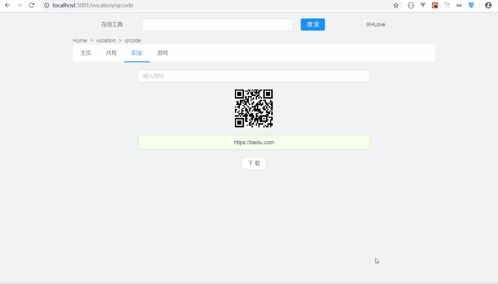
- [x] 数独
	-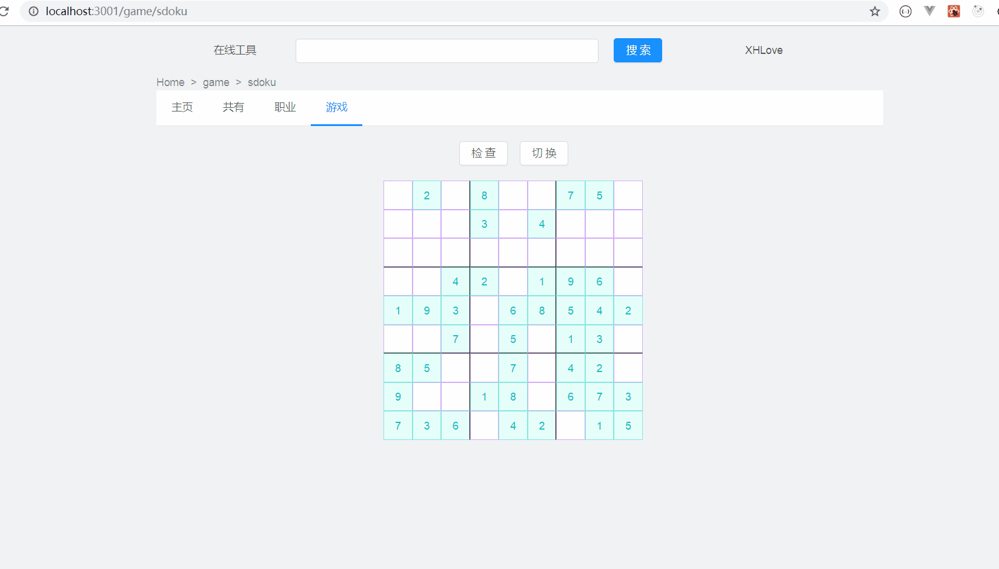
- [x] 扫雷
	-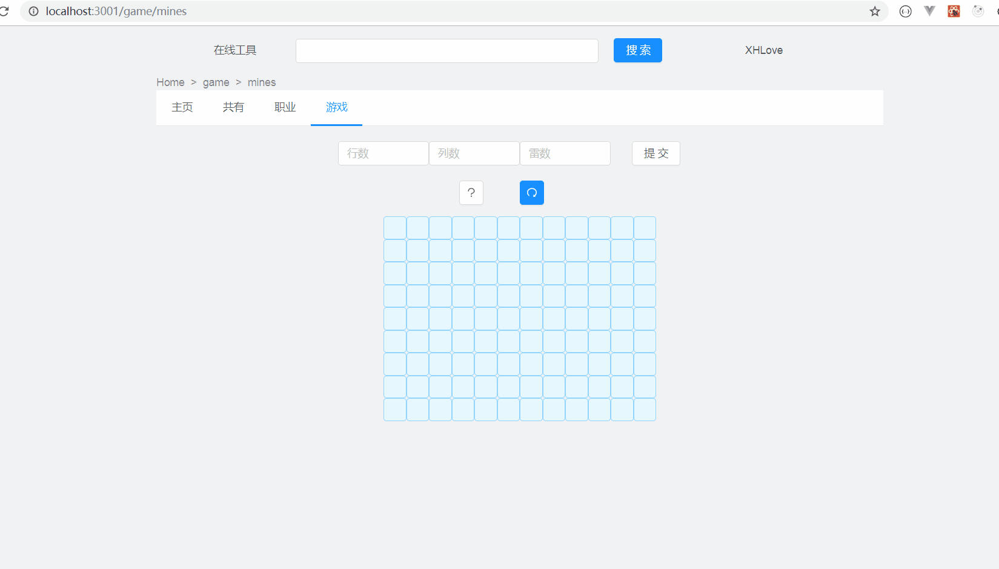
- [x] 贪吃蛇
	-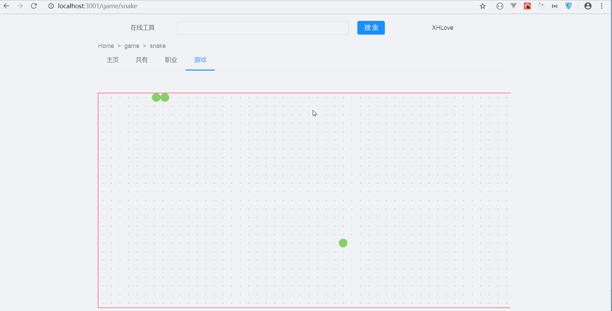
- [x] 记忆大师
	- **连续点击相同的两个图标直至翻开所有图标。**
	-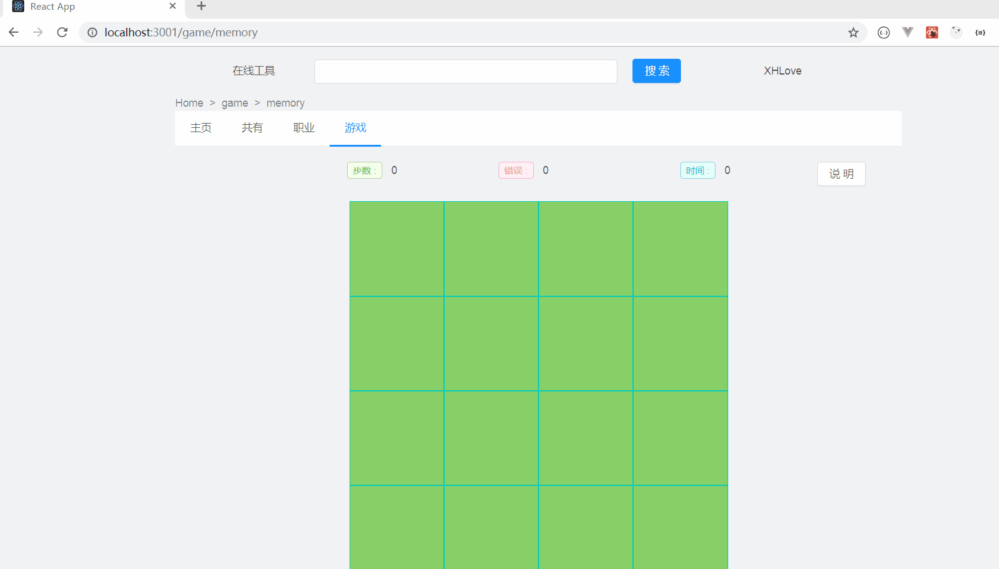
- [x] 记忆大师2
	- **按照从小到大的顺数找到扑克牌**
	-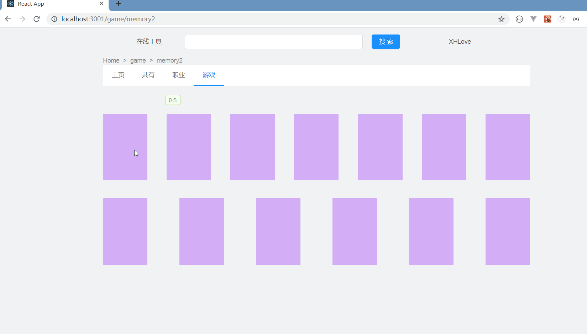
- [x] 华容道解密
	- **实现一个华容道算法的可视化**
	-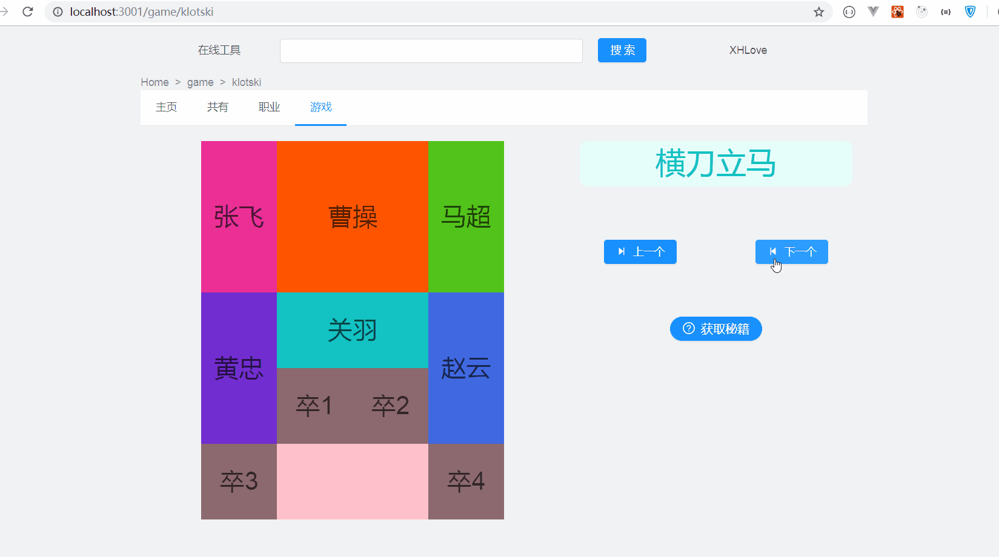
- [x] 竹竿游戏
	-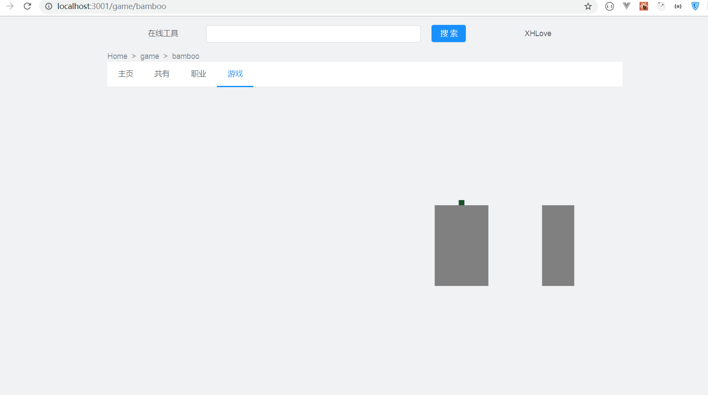
#待完成

----

- 打字软件
	- 通过上传文本，实现多行展示多行输入，
	- 难点： 判断每一行有那些字符。

- 正则分解可视化
	- 已经分解
	- 未完成： 可视化。
